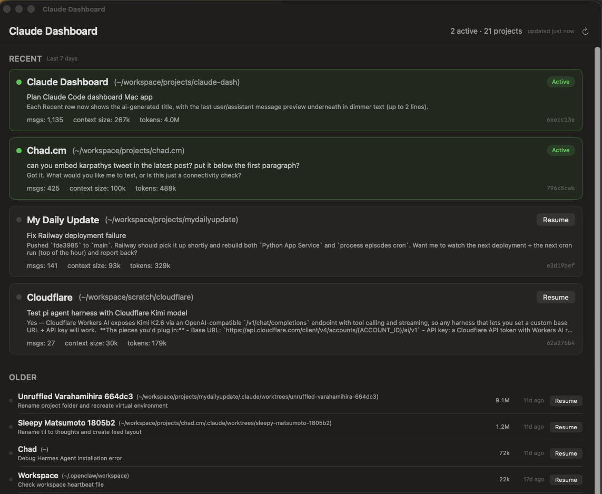

# Claude Dash

A dashboard for Claude Code sessions to easily organize your active and recent sessions. For those who like working on the terminal but also have lots of projects going in parallel.



## Requirements

- macOS 14+
- Swift 5.9+ toolchain
- Ghostty installed at `/Applications/Ghostty.app`

## Build & run

```
./build_app.sh && open ClaudeDash.app
```

## What it does

- Scans `~/.claude/projects/` for session JSONL files
- Polls running `claude` processes every 5s to mark active sessions green
- Right-click a row to rename a project; names persist under `~/Library/Application Support/ClaudeDash/`
- Resume launches `claude --resume <id>` in a new Ghostty window
- Lives in the menu bar too, with a popover of the same data
